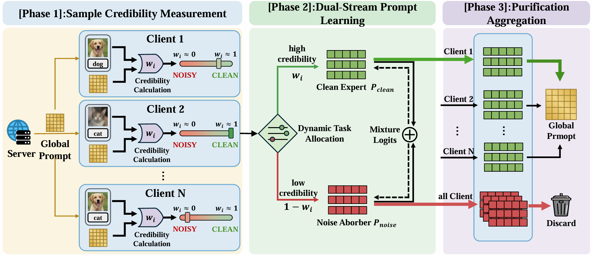

# FedRGP

FedRGP: Robust Global-Consensus Prompting for Federated Vision-Language Adaptation with Noisy Labels

## Supported datasets

The repository contains the data loaders and launch scripts for the seven
base-to-novel datasets used in our experiments:

- Caltech101
- DTD
- FGVC Aircraft
- Food101
- Oxford Flowers
- Oxford Pets
- UCF101

## Installation

Create a Python environment (Python 3.8 or later), then install a PyTorch and
torchvision build compatible with your CUDA version. Install the remaining
dependencies from the repository root:

```bash
pip install -r requirements.txt
cd FedRGP
```

## Smoke test

Before preparing any dataset, verify the installation and repository layout:

```bash
python scripts/smoke_test.py
```

This test imports the project, validates the seven dataset configurations and
all shell launchers, and confirms that no legacy method name remains. It does
not access datasets, download CLIP weights, or start training.

## Dataset location

Put the seven datasets under one directory and export it before running:

```bash
export COOP_DATASET=/path/to/datasets
```

Expected directory names are:

```text
$COOP_DATASET/
├── caltech-101/
├── dtd/
├── fgvc_aircraft/
├── food-101/
├── oxford_flowers/
├── oxford_pets/
└── ucf101/
```

Each dataset follows the standard directory structure expected by its loader.
The split and few-shot cache files are generated in the corresponding dataset
directory when they do not already exist.

## Run

From the inner `FedRGP` source directory, run one dataset with:

```bash
SEED=0 NOISE_RATIO=0.4 NOISE_TYPE=pairflip \
  bash train_caltech101.sh 0 16 base2novel_vit_b16
```

Arguments are GPU ID, number of shots, and configuration name. The available
launchers are `train_caltech101.sh`, `train_dtd.sh`, `train_fgvc_aircraft.sh`,
`train_food101.sh`, `train_oxford_flowers.sh`, `train_oxford_pets.sh`, and
`train_ucf101.sh`.

To run all seven datasets:

```bash
bash scripts/run_all_datasets.sh 0 base2novel_vit_b16 16
```

For custom datasets or multiple seeds, use `scripts/run_custom_dataset.sh` and
`scripts/run_multi_seeds.sh` with the usage shown when called without valid
arguments.

## Outputs

Training checkpoints, TensorBoard files, and FedRGP logs are written under
`FedRGP/output/`. They are excluded from version control by `.gitignore`.
